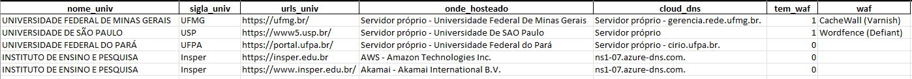
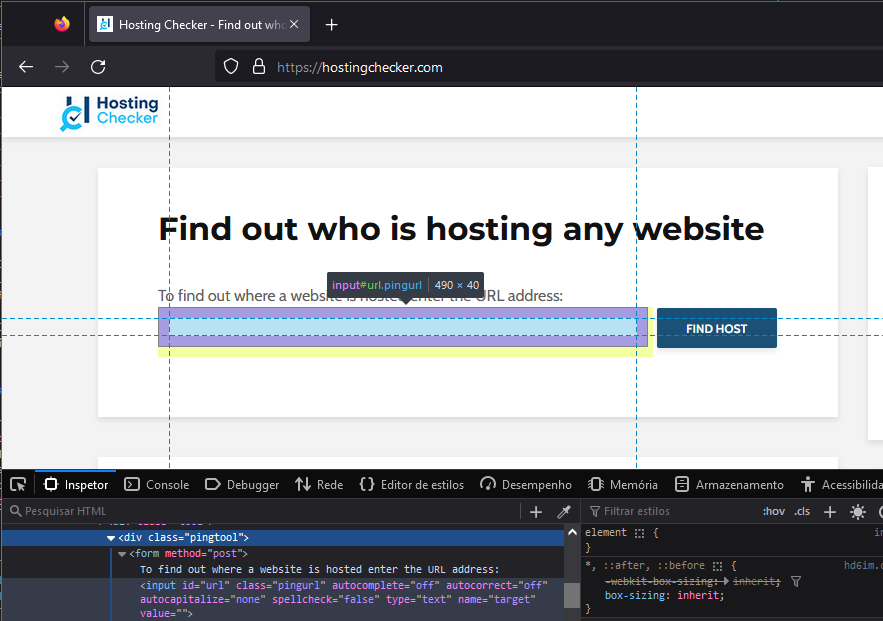
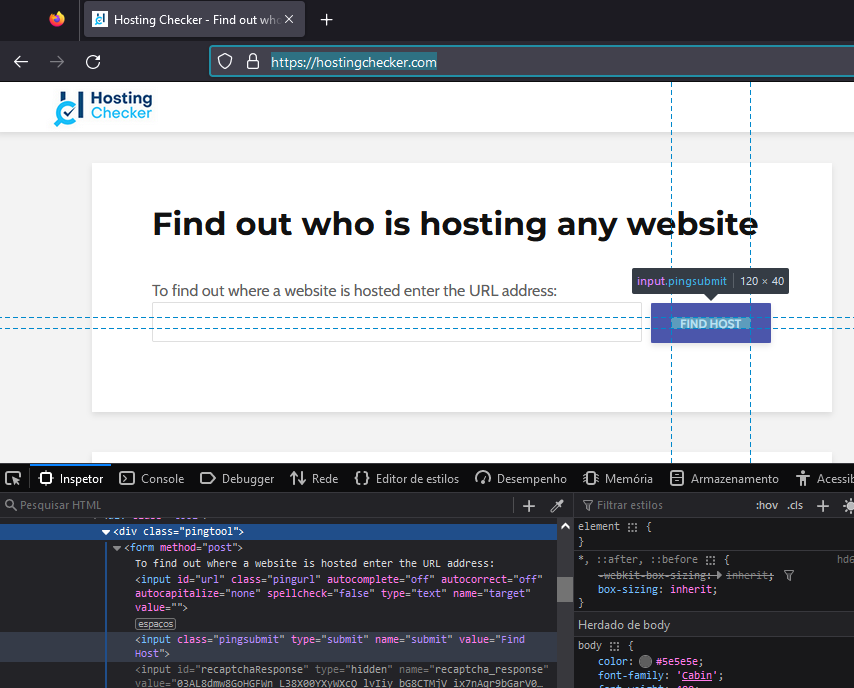

# UniWebScan

Script, em python, para obter informações sobre universidades brasileiras.

- #### Onde o site está hospedado
    Verifica se o site está hospedado em um servidor da universidade, próprio ou em um servidor externo. 

    Foram verificados os seguintes servidores:
    - [x] Google Cloud Platform
    - [x] Amazon Web Services
    - [x] Microsoft Azure
    - [x] Cloudflare
    - [x] Akamai

- #### Onde o servidor DNS está hospedado
    Verifica se o servidor DNS está hospedado em um servidor da universidade, próprio ou em um servidor externo. 

- #### Informações sobre WAF (Web Application Firewall)
    Verifica se o site está protegido por um WAF e, caso esteja, qual(is) WAF(s) utilizado(s).


As informações serão colocadas no arquivo `info_universidades.xlsx`, que possui as colunas:

- `nome_univ`: Nome da universidade.
- `sigla_univ`: Sigla da universidade.
- `url_univ`: URL do site da universidade.
- `onde_hosteado`: Nome do provedor de serviços de infraestrutura como serviço (IaaS) onde o site está hospedado.
- `cloud_dns`: Nome do provedor de serviços de infraestrutura como serviço (IaaS) onde o servidor DNS está hospedado.
- `tem_waf`: Se o site possui WAF.
- `waf`: Nome do(s) WAF(s) utilizado(s).

 Um exemplo de como a tabela ficará após a execução do programa:



___
## Instalação

Para usar o UniWebScan, é necessário ter o python3 instalado. Tendo python, basta clonar o repositório e instalar as dependências.

```bash
git clone
cd UniWebScan
```

Depois, instale as dependências.

```bash
pip install -r requirements.txt
```

___
## Uso
Para começar a rodar o programa, basta rodar o comando:

```bash
python3 main.py -u <url>
```

Depois, o programa será iniciado.

**Obs:** A qualquer momento, é possível sair do programa usando 'ctrl'+'c'.

Será pedido que se coloque a url do site que se deseja obter informações. O terminal ficará assim:

```bash
Digite a URL de uma universidade brasileira que deseja escanear EX: https://ufrj.br/
Digite 'Sair' para sair do programa.
URL: 
```

Um exemplo:
```bash	
URL: https://www.insper.edu.br/
```

Depois, URL será validada e será checado se pertence a uma universidade brasileira. Caso não seja, o programa será encerrado. 

___
## Sobre o código

### Obtendo onde o site está hospedado

#### IaaS (Infrastructure as a Service) 

Para obter a informação de em qual servidor o site está hospedado, foi feito o arquivo `iaas_ips.py`. Neste arquivo, foi feita a classe `IAASIPs`, que é uma implementação que permite obter os intervalos de endereços IP de provedores de serviços de infraestrutura como serviço (IaaS). Atualmente, ele suporta os seguintes provedores:

- Amazon Web Services (AWS)
- Google Cloud Platform (GCP)
- Oracle Cloud Infrastructure (OCI)
- Microsoft Azure
- Cloudflare
- Akamai


Para usar a classe `IAASIp` e obter os intervalos de endereços IP de cada provedor de serviços, foram feitas as etapas abaixo:

1. Importou-se a biblioteca `requests` no arquivo `main.py`.

```python
import requests
```

2. Importou-se a classe `IAASIp` do arquivo contendo o código fornecido.

```python
from iaas_ip import IAASIp
```

3. Crie uma instância da classe `IAASIp`.

```python
iaas_ips = IAASIp()
```

Deste modo, se obteve acesso os intervalos de endereços IP de cada provedor por meio dos seguintes atributos da instância `ips`:

- `ips.ips_aws`: Conjunto de intervalos de endereços IP da Amazon Web Services (AWS).
- `ips.ips_gcp`: Conjunto de intervalos de endereços IP do Google Cloud Platform (GCP).
- `ips.ips_oracle`: Conjunto de intervalos de endereços IP do Oracle Cloud Infrastructure (OCI).
- `ips.ips_azure`: Conjunto de intervalos de endereços IP do Microsoft Azure.
- `ips.ips_cloudflare`: Conjunto de intervalos de endereços IP do Cloudflare.
- `ips.ips_akamai`: Conjunto de intervalos de endereços IP da Akamai.

No método `check_iaas` da classe WebScan em `main.py`, caso seja identificado um dos cloud providers, seu nome é adicionado na coluna `onde_hosteado` da tabela. 


##### Observações

- Durante a inicialização da classe `IAASIp`, os intervalos de endereços IP são obtidos por meio de solicitações HTTP aos URLs fornecidos pelos provedores de serviços. Portanto, é necessária uma conexão com a internet para obter essas informações atualizadas.

- Os intervalos de endereços IP fornecidos estão em formato de conjunto (conjunto de Python) para permitir operações eficientes de pertinência (verificar se um IP específico pertence a um provedor específico).


#### Servidor da própria universidade

Para verificar se o site está hospedado em um servidor próprio, foram feitos alguns passos. O primeiro deles foi usar o site Host Checker (https://hostingchecker.com/). Este site permite verificar onde o site está hospedado. Para isso, basta colocar a url do site e clicar em "Check Hosting". 
Deste modo, para automatizar este processo, foi criada a classe CheckHosting, que é uma classe que herda da classe Robo do projeto "Robo Selenium" disponível no GitHub, criado pelo autor Rafael dos Santos (https://github.com/4rfel/Robo-Selenium.git). 

Na classe, foi criado o método check_hosting, que recebe a url do site de universidade que se quer checar e depois chama os métodos da classe Robo para abrir o site e preencher o campo de url. Depois, o método clica no botão de submit e obtém o nome do servidor. 

Preenchendo o campo de url com a url da universidade:
```python	
self.go_to_url("https://hostingchecker.com/") # Abrindo o site
self.wait_until_find_send_keys(By.CSS_SELECTOR, "input#url", url2check) # Preenchendo o campo de URL
```




Clicando no botão de submit:
```python
self.wait_until_find_click(By.CSS_SELECTOR, "input.pingsubmit") # Clicando no botão de submit
```


Obtendo o nome do servidor:
```python
host = self.wait_until_find(By.CSS_SELECTOR, ".hcresults > p:nth-child(2) > b:nth-child(1)") # Obtendo o nome do servidor
```
Caso não consiga obter o nome do servidor, tenta novamente. Se não conseguir, retorna None.

Deste modo, com o nome do servidor, é possível verificar se o site está hospedado em um servidor da própria universidade. Para isso, no método `check_iaas` `no main.py`, verifica-se se o nome do servidor está no dataframe com universidades brasileiras. Por fim, caso esteja, o nome do servidor próprio é adicionado na coluna `onde_hosteado` da tabela.

### Obtendo onde servidor DNS está hospedado
O método `check_dns_server` é responsável por verificar onde o servidor DNS de um determinado URL está hospedado. Utiliza a biblioteca `tldextract` para extrair o nome de domínio e sufixo do URL fornecido. Em seguida, ela constrói a URL de consulta DNS usando o Google Public DNS e realiza uma solicitação HTTP para obter informações sobre o servidor DNS. Por fim, ela preenche a coluna `cloud_dns` do dataframe com o nome do servidor onde o servidor DNS está hospedado.

### Obtendo informações sobre WAF (Web Application Firewall)
O método `check_waf` é responsável por verificar se um site possui Web Application Firewall (WAF). Ele utiliza a biblioteca `WAFW00F` para realizar a verificação.
Por meio da biblioteca, é possível obter o nome do(s) WAF(s). A função preenche a coluna `waf` do dataframe com o(s) nome(s) do(s) WAF(s) encontrado(s) e preenche a coluna `tem_waf` com 1, caso o site possua WAF, ou 0, caso não possua.
